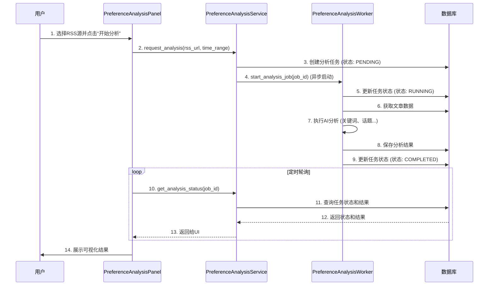

# “内容偏好分析”功能开发计划

---

## 1. 总体架构设计

基于对现有代码库的分析和PRD的要求，我们设计以下架构来支持内容偏好分析功能。此架构旨在实现模块化、可扩展和关注点分离。

### 1.1 模块划分

我们将引入或扩展以下模块：

1.  **`PreferenceAnalysisService` (新增服务):**
    - **职责:** 核心业务逻辑协调器。负责接收来自UI的分析请求，调用数据采集模块，启动异步分析任务，并将结果存入数据库。
    - **位置:** `src/services/preference_analysis_service.py`

2.  **`PreferenceAnalysisWorker` (新增后台任务模块):**
    - **职责:** 执行计算密集型的AI分析。它将从数据库读取待分析数据，使用AI模型（如`spaCy`, `scikit-learn`或外部API）进行关键词提取、话题建模等，然后将结果写回数据库。
    - **技术:** 采用Python的 `threading` 或 `multiprocessing` 来实现简单的后台任务，避免引入`Celery`等重型依赖，保持项目轻量级。
    - **位置:** `src/workers/preference_analysis_worker.py` (需创建 `src/workers` 目录)

3.  **`Database` (扩展/新增数据模型):**
    - **职责:** 持久化存储分析任务的状态、原始数据和分析结果。
    - **技术:** 使用 `SQLite`，通过 `SQLAlchemy` 进行ORM。
    - **扩展:** 在 `src/database/models.py` (如果存在，或新建) 中增加 `AnalysisJob` 和 `AnalysisResult` 等表模型。

4.  **`RssService` (扩展):**
    - **职责:** 扩展现有 `rss_service`，增加一个方法 `fetch_historical_articles(rss_url, time_range)`，用于获取指定时间范围内的历史文章。

5.  **`PreferenceAnalysisPanel` (UI模块，已创建):**
    - **职责:** 用户交互界面。负责向 `PreferenceAnalysisService` 发起分析请求，并定期轮询任务状态，获取并可视化最终的分析结果。

### 1.2 数据流

## 2. 开发任务分解 (Task Breakdown)

### Phase 1: 后端基础建设 (P0)

- **Task 1.1: 数据库模型设计**
  - **描述:** 在 `src/database/` 下创建 `models.py`，定义 `AnalysisJob` 和 `AnalysisResult` 两个SQLAlchemy模型。
  - **负责人:** DB-Agent
  - **依赖:** 无

- **Task 1.2: 后台工作者框架**
  - **描述:** 创建 `src/workers/preference_analysis_worker.py`。实现一个基础的Worker类，能够接收任务ID并在一个单独的线程中运行。
  - **负责人:** Backend-Agent
  - **依赖:** 无

- **Task 1.3: 核心服务层**
  - **描述:** 创建 `src/services/preference_analysis_service.py`。实现 `request_analysis` 方法，负责创建数据库任务记录和启动Worker。
  - **负责人:** Backend-Agent
  - **依赖:** Task 1.1, Task 1.2

### Phase 2: 数据与AI核心功能 (P0)

- **Task 2.1: 扩展RSS服务**
  - **描述:** 修改 `src/services/rss_service.py`，添加 `fetch_historical_articles` 功能，用于抓取并存储指定源的历史文章。
  - **负责人:** Backend-Agent
  - **依赖:** Task 1.1

- **Task 2.2: 实现关键词提取**
  - **描述:** 在 `PreferenceAnalysisWorker` 中，实现第一个核心分析功能：关键词提取。可使用 `jieba` (中文分词) + TF-IDF 算法。
  - **负责人:** AI-Agent
  - **依赖:** Task 1.2

### Phase 3: UI与后端集成 (P1)

- **Task 3.1: UI发起分析请求**
  - **描述:** 在 `PreferenceAnalysisPanel` 中，为“开始分析”按钮绑定事件，调用 `PreferenceAnalysisService.request_analysis`。
  - **负责人:** Frontend-Agent
  - **依赖:** Task 1.3

- **Task 3.2: UI轮询与结果展示**
  - **描述:** 实现UI的定时轮询机制，调用服务获取任务状态和结果，并首先在界面上以列表形式展示关键词分析结果。
  - **负责人:** Frontend-Agent
  - **依赖:** Task 3.1, Task 2.2

### Phase 4: 高级功能与优化 (P2)

- **Task 4.1: 实现话题建模**
  - **描述:** 在 `PreferenceAnalysisWorker` 中，增加话题建模功能（如LDA）。
  - **负责人:** AI-Agent
  - **依赖:** Task 2.2

- **Task 4.2: 结果可视化**
  - **描述:** 在UI端，将关键词列表升级为词云图，将话题分布数据渲染为饼图。
  - **负责人:** Frontend-Agent
  - **依赖:** Task 3.2, Task 4.1

- **Task 4.3: 应用优化建议**
  - **描述:** 实现将分析出的关键词应用到 `filter_config` 的功能。
  - **负责人:** Backend-Agent, Frontend-Agent
  - **依赖:** Task 3.2

## 3. 技术风险与缓解措施

- **风险1: 异步任务管理复杂性**
  - **缓解:** 初期使用 `threading` 保持简单。如果未来任务增多，再考虑迁移到 `Celery`。在Service层做好任务状态管理和异常处理。

- **风险2: AI模型准确率**
  - **缓解:** 优先使用成熟的库（`jieba`, `scikit-learn`）。提供配置选项，允许用户未来切换到更强大的外部LLM API。

- **风险3: UI阻塞**
  - **缓解:** 严格遵守数据流设计，所有耗时操作（网络请求、AI计算）均不在UI线程执行。UI仅负责请求和轮询。